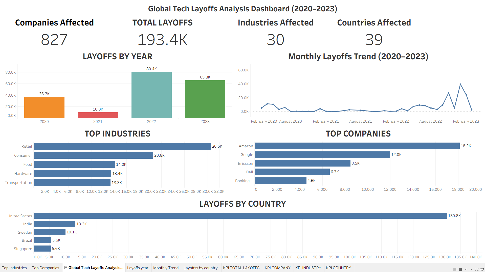
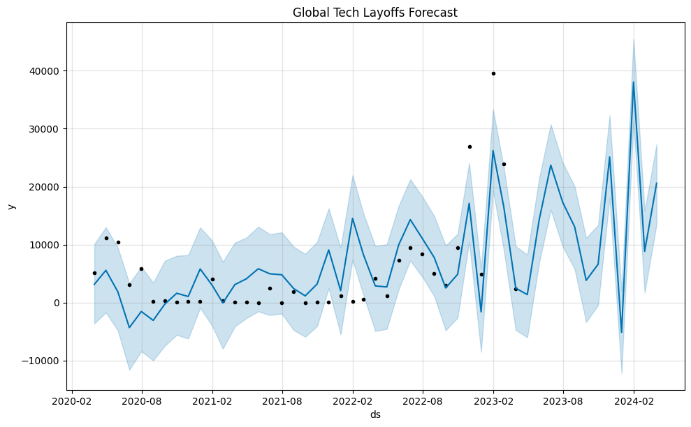

# Global Tech Layoffs Analysis (2020–2023)

## Project Overview

This project analyzes global technology layoffs from 2020–2023 using SQL, Tableau, and Python.

## Project Workflow

1. Data Cleaning using SQL
2. Exploratory Data Analysis (EDA)
3. Interactive Dashboard Creation in Tableau
4. Forecasting Future Layoffs using Facebook Prophet
5. Insights & Recommendations

## Tools Used

* SQL (Data Cleaning & Analysis)
* Tableau (Interactive Dashboard)
* Python (Layoff Forecasting with Prophet)

## Key Insights

* Total layoffs: 193.4K
* Companies affected: 827
* Industries affected: 30
* Countries affected: 39

## Dashboard

## Forecasting

Used Facebook Prophet to forecast future layoff trends based on historical monthly layoff data.

## Forecasting Future Layoffs

## Skills Demonstrated

- SQL
- Data Cleaning
- Exploratory Data Analysis
- Tableau Dashboarding
- Data Visualization
- Time Series Forecasting
- Python (Pandas, Prophet)
- Git & GitHub

## Files

* layoffs_analysis.sql
* data_exploratory.sql
* data_cleaning.sql
* advanced_Sql.sql
* forecasting_layoffs.ipynb
* layoffs_forecast.csv
* layoffs_forecast.png
* dashboard.png
  
